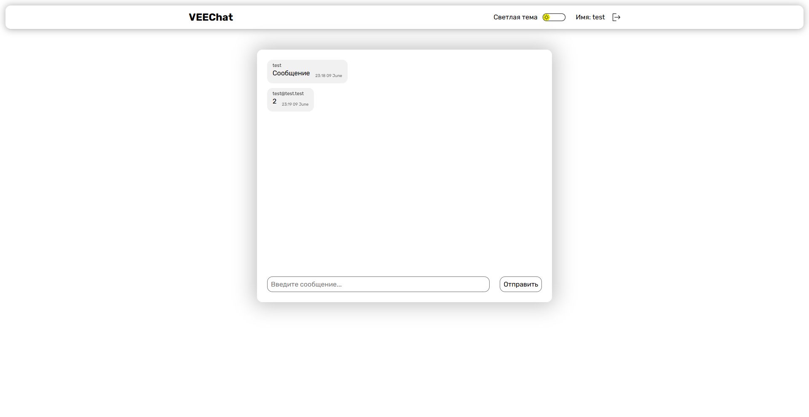
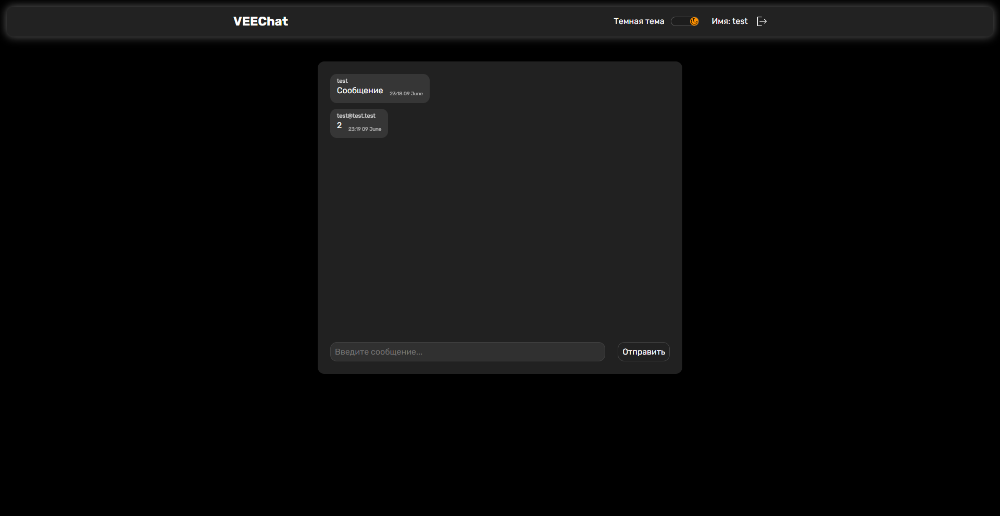

# 💬 Vue Online Chat

[](https://vuejs.org/)
[](https://pinia.vuejs.org/)
[](https://router.vuejs.org/)
[](https://www.typescriptlang.org/)
[](https://supabase.com/)
[](https://day.js.org/)
[](https://vitejs.dev/)

### https://hutt4.github.io/vue-online-chat

Онлайн-чат с авторизацией и realtime-обновлениями на Vue 3 и Supabase.

| Светлая тема                                              | Темная тема                                             |
| --------------------------------------------------------- | ------------------------------------------------------- |
|  |  |

## 🌟 Особенности

### Чат функционал

- 📡 Обновления чата в реальном времени через Supabase Realtime
- 🗂️ Полная история сообщений
- 🙋‍♂️ Отображение информации об отправителе

### Безопасность

- 🔐 Регистрация и вход через Supabase Auth
- 🔒 Настроенные политики RLS
- 🛡️ Защищенные роуты

### Интерфейс

- 🌓 Темная/светлая тема
- 📅 Удобное форматирование дат

## 🛠 Технологии

### Frontend

- [Vue 3](https://vuejs.org/) - Фреймворк
- [Pinia](https://pinia.vuejs.org/) - Управление состоянием
- [Vue Router](https://router.vuejs.org/) - Навигация
- [TypeScript](https://www.typescriptlang.org/) - Типизация

### Backend/Utilities

- [Supabase](https://supabase.com/) - Бэкенд (Auth, Realtime, Database)
- [Day.js](https://day.js.org/) - Форматирование дат
- [Vite](https://vitejs.dev/) - Сборка проекта

## 🚀 Быстрый старт

```bash
git clone https://github.com/huTT4/vue-online-chat.git

cd vue-online-chat

npm install

npm run dev
```
