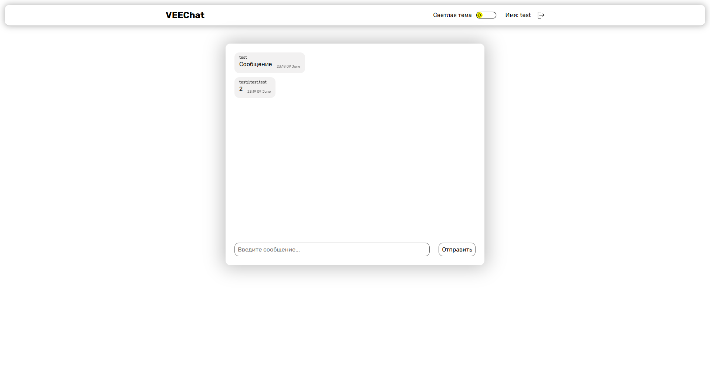
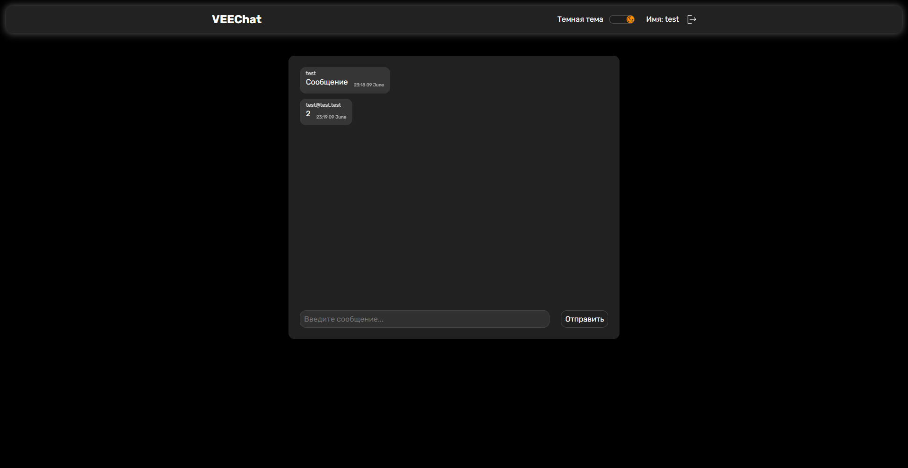

# 💬 Vue Online Chat

[](https://vuejs.org/)
[](https://www.typescriptlang.org/)
[](https://supabase.com/)
[](https://opensource.org/licenses/MIT)

Онлайн-чат с авторизацией и realtime-обновлениями на Vue 3 и Supabase.

| Светлая тема                                              | Темная тема                                             |
| --------------------------------------------------------- | ------------------------------------------------------- |
|  |  |

## 🌟 Особенности

### 💌 Чат функционал

- Обновления чата в реальном времени через Supabase Realtime
- Полная история сообщений
- Отображение информации об отправителе

### 🔐 Безопасность

- Регистрация и вход через Supabase Auth
- Защищенные маршруты (Vue Router Navigation Guards)
- Row-Level Security (RLS) политики

### 🎨 Интерфейс

- Темная/светлая тема
- Удобное форматирование дат

## 🛠 Технологический стек

### Frontend

- ⚡️ [Vue 3](https://vuejs.org/) - Компонентный фреймворк
- 🏗️ [Vite](https://vitejs.dev/) - Сборка проекта
- 🎨 [Pinia](https://pinia.vuejs.org/) - Управление состоянием
- 🛣️ [Vue Router](https://router.vuejs.org/) - Навигация

### Backend/Services

- 🔄 [Supabase](https://supabase.com/) - Бэкенд (Auth, Realtime, Database)
- 📅 [Day.js](https://day.js.org/) - Форматирование дат

## 🚀 Быстрый старт

```bash
git clone https://github.com/huTT4/vue-kanban.git

cd vue-online-chat

npm install

npm run dev
```
